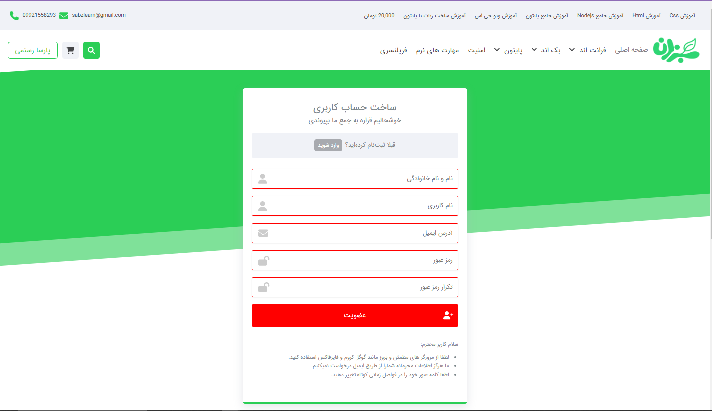

# Sabzlearn educational institutions (NEW UPDATE)


[Sabzlearn](https://sabzlearn.ir) is an Online programming institutions

## Tools
<div style="display:flex ;">
  


</div>


## Features

1. Register, login, and logout using JWT
2. Authentication and Authorization
2. Single Page Application 
3. Inputs Validators
4. Pagination
5. Dashboard Admin (NEW!!  To access cms login with ||USERNAME : amin_saeedi / PASSWORD : 123456789||   then go to "/admin-panel" route)
6. Add, delete, and edit new courses, sessions, articles, users, etc. (NEW)
7. Swiper.js
8. ckeditor

## Installation

Use the npm to install sabzlearn.\
run Backend :
```bash
cd backend
npm i
npm run dev
```
run Frontend :
```bash
cd frontend
npm i
npm start
```

> NOTE : The backend of this project is designed by the backend development team, and if there is a problem, the frontend developers are not involved.


